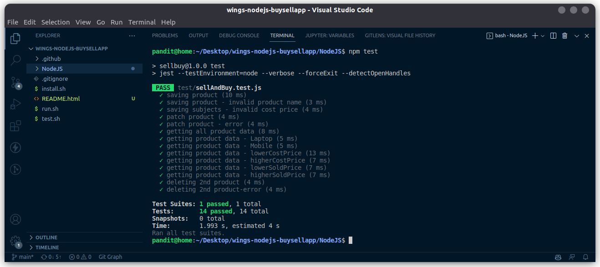

## Kickoffs - NodeJS - Sell And Buy Product

Build an application for the shop, where the shopkeeper can maintain the list of product **bought** and **sold**

- **SellAndBuy** is the name of the database used in this application.
- A collection of named **sellbuys** present in the database.

### COLLECTIONS : 

There is a single file for collection namely **sellBuy.js** that reside inside **src/mongoose/models**. The schema of the collection is given as follows.

| **SI.No** | **Field Name** | **Type** | **Validations**                                     | **Required** |
| --------- | -------------- | -------- | --------------------------------------------------- | ------------ |
| 1         | \_id           | ObjectID | Auto-generated                                      | -            |
| 2         | productName    | String   | Product name should have minimum of four characters | TRUE         |
| 3         | costPrice      | Number   | cost price value cannot be zero or negative value   | TRUE         |
| 4         | soldPrice      | Number   | sold price value cannot be zero or negative value   | -            |
| 5         | \_v            | Number   | Auto-generated                                      | -            |

You should create the model as details mentioned above

### ROUTERS :

There is a single file for routers namely **sellAndBuy.js** that reside inside **src/routers**. The endpoints and their functionalities are as follows.

**1) /sellProduct -> GET Method ->** This route should fetch all the data from the the **sellbuys** collection. If any query is passed , then the data should be fetched based on that.

**Sample Request**

- **/sellProduct** - should return all data
- **/sellProduct?product="Laptop"** - should return the data which has productName as "Laptop". Here the product name can differ.
- **/sellProduct?sortBy="lowerCostPrice"** - should sort the data from lower to higher cost price of the product.
- **/sellProduct?sortBy="higherCostPrice"** - should sort the data from higher to lower cost price of the product.
- **/sellProduct?sortBy="lowerSoldPrice"** - should sort the data from lower to higher sold price of the product.
- **/sellProduct?sortBy="higherSoldPrice"** - should sort the data from higher to lower sold price of the product

**Sample Response Data**

```json
[
  {
    "_id": "61b846aee947043c2c22820d",
    "productName": "Table",
    "costPrice": 3000,
    "__v": 0
  },
  {
    "_id": "61b846aee947043c2c22820b",
    "productName": "Mobile",
    "costPrice": 4500,
    "soldPrice": 4000,
    "__v": 0
  }
]
```

- If the data is fetched successfully from the database, then you should send a response code of 200 If something went wrong and the data is not fetched successfully from the database, then you should send a response code of 400

**2) /sellProduct** -> POST Method ->**This route should save the data sent with the request body in the** sellbuys collection.

**Sample data send with the request:**

```json
{
  "productName": "Table",
  "costPrice": 1000
}
```

- You should save the data sent in the request body to the sellbuys collection as separate records or documents
- If the insertion was successful, then you should send a response code of **201** along with a message "Product Added" should be sent.
- If some data validations failed and the data is not inserted into the collection then you should send a response code of **400.**
- Error message should be sent along with response code of 400, as **"product name should have minimum of four characters"** when the **product name** sent in request body has **less than four characters**
- Error message should be sent along with response code of 400, as **"cost price value cannot be zero or negative value"** when the **cost price** sent in request body has **zero or negative** value.

**3) /sellProduct:id** -> PATCH Method ->** This route should find and update the data sent with the request body in the **sellbuys collection.

**Sample data send with the request:**

```json
{
  "soldPrice": 1000
}
```

- You should update the data sent in the request body to the to the record in the sellbuys collection which match the id param
- If the updation was successful, then you should send a response code of **200** along with a message "Updated Successfully" should be sent.
- If some data validations failed and the data is not inserted into the collection then you should send a response code of **400.**
- Error message should be sent as **"sold price value cannot be zero or negative value"** when the **sold price** sent in request body has **zero or negative value**.

**4) /sellProduct:id** -> DELETE Method -> Finds the report by the id passed through url parameter and deletes it.

- You should delete the data present in the sellbuys collection
- If the deletion was successful, then you should send a response code of **200** along with a message **"Deleted successfully"** .
- If something went wrong and the data is not deleted successfully from the database, then you should send a response code of **400**.

**Instructions To Note:**

- If you want to install project(NodeJS) dependecies, run **_install.sh_** in terminal
- If you want to run your application, run **_run.sh_** in terminal (you can also view your application with UI on port 8001 in the browser)
- To run test cases, run **_test.sh_** in terminal

**MongoDB Commands:**

- You can open the mongo shell by running mongo from the terminal.
- You can view all the data from the database in MongoDB by running **show dbs** from the mongo shell.
- You can select the database by running **use SellAndBuy**.
- You can view the names of the collections by running **show collections**.
- You can view the data inside a collection by running **db.sellbuys.find()**
- Press **ctrl+c** to exit.

## Test Cases :

